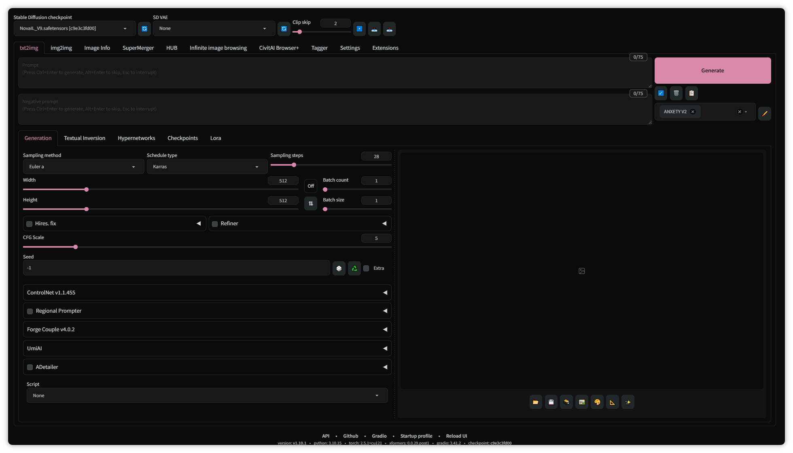
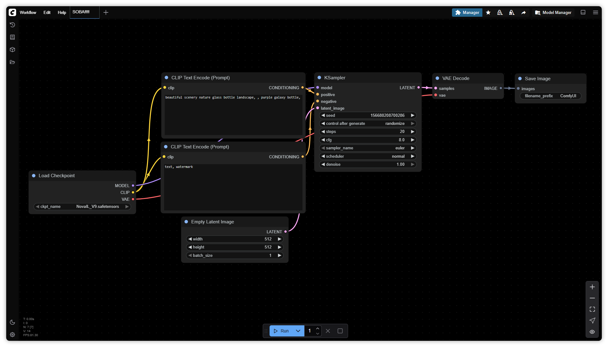
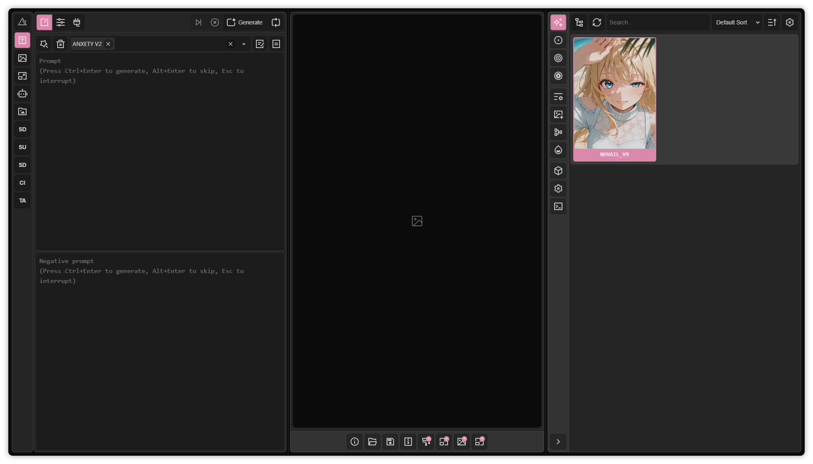

    <h2>Anxety Dark Theme for Stable Diffusion WebUI (UX) | ComfyUI</h2>
    <h3>Gradio 3/4 Compatible • Modular CSS System</h3>

    <h6>-> A1111/Forge <-</h6>
    
    <h6>-> ComfyUI <-</h6>
    
    <h6>-> SD-UX <-</h6>
    

<h1></h1>

### 🛠 Installation

#### For A1111/Forge/SD-UX (Extension Method)
1. Open WebUI
2. Navigate to "Extensions" → "Install from URL"
3. Paste `https://github.com/anxety-solo/anxety-theme`
4. Click "Install" and reload WebUI
5. Go to Settings → "Anxety Theme" to configure options
6. Apply settings and fully reload the UI

#### For ComfyUI (Theme Import Method)
1. Download the theme file (RAW) → [`comfy-anxety.json`](https://raw.githubusercontent.com/anxety-solo/anxety-theme/refs/heads/main/comfy-anxety.json)
2. Open ComfyUI
3. Go to Settings → Appearance → "Color Pallete"
4. Import `comfy-anxety.json`
5. Done :3

### 🎨 Theme Integration with Extensions

The theme also **modifies the style and design** of several Stable Diffusion WebUI extensions, providing a consistent and visually appealing user experience throughout the interface. Specifically, it supports:

- **ControlNet (Integrated)**: The theme customizes the buttons for a cleaner UI.

- **SD-Hub**: The theme adapts its UI elements to match the overall dark aesthetic.
   [GitHub - gutris1/sd-hub](https://github.com/gutris1/sd-hub)

- **TagComplete**: The theme customizes its autocomplete dropdown and input styling to blend seamlessly with the dark theme environment.
   [GitHub - DominikDoom/a1111-sd-webui-tagcomplete](https://github.com/DominikDoom/a1111-sd-webui-tagcomplete)

<h1></h1>

 <h6>🖌 Based on <a href="https://github.com/catppuccin/stable-diffusion-webui">Catppuccin Theme</a> 🖌</h6> 
